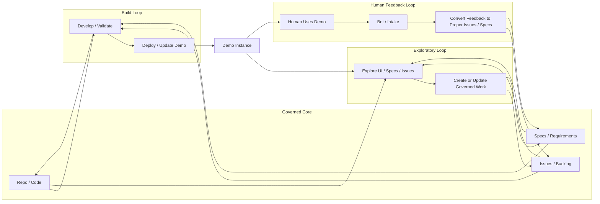
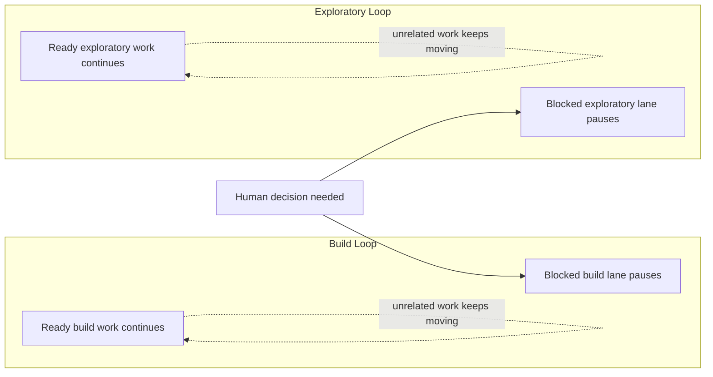

A lot of agent discussions still assume there is one loop.

The agent is running.
The loop is going.
Work is happening.

That sounds fine until you try to govern it.
Then you discover that "the loop" is hiding several different kinds of work with different sources, different outputs, and different reasons to pause.

VibeGov should be more explicit.

## The real shape is usually three loops

In practice, agent-enabled work often has at least three loops running in parallel:

- a **Build Loop**
- an **Exploratory Loop**
- a **Human Feedback Loop**

And once those exist, you also need one important rule for how they pause:

- **Scoped Blocking**

## 1) Build Loop

The Build Loop is the delivery loop.

Its job is not to invent work.
Its job is to consume already-governed work and turn it into clear outputs.

That means the Build Loop should take input from:
- the repository,
- the issue backlog,
- the bound specs or requirements,
- and the current governed delivery state.

And it should write back:
- code,
- docs,
- tests,
- evidence,
- issue or PR state,
- release-readiness or shipping outputs when relevant.

The important boundary is this:

**build should not recursively self-source its own next work from its own outputs.**

If it does, the delivery loop becomes unstable.
Instead of a governed execution path, you get a self-expanding activity engine.

## 2) Exploratory Loop

The Exploratory Loop is the non-delivery intelligence loop.

Its job is to inspect reality and feed governed work into delivery.

That can include:
- UI exploration,
- workflow review,
- spec exploration,
- issue exploration,
- drift detection,
- gap analysis,
- backlog hydration,
- and exploratory report generation.

This is also where a lot of confusion happens.
People hear planner or evaluator and assume those roles must belong to a delivery harness.
But that is too narrow.

In VibeGov terms, exploratory work can absolutely include:
- **planner-style scoping** of a review surface,
- **evaluator-style judgment** of coverage, artifacts, or review quality,
- and even **generator-style output** when the output is an exploratory artifact rather than a delivered product change.

What makes the work exploratory is not the role name.
What makes it exploratory is that it is **not directly delivering the product change**.

## 3) Human Feedback Loop

A lot of loop talk accidentally removes the human except as a final approver.
That is too weak.

The Human Feedback Loop should be first-class.

Its job is to inject:
- approval,
- correction,
- judgment,
- taste,
- reprioritisation,
- missing context,
- or strategic redirection.

Without this loop, the human falls out of the operating model.
Then teams start claiming the human is "in the loop" when the human is really only around to react to surprises.

## 4) Scoped Blocking

Once you accept that there are multiple loops, blocker handling has to get sharper too.

A human question, missing dependency, or unresolved approval should not automatically freeze everything.

That is why VibeGov needs **scoped blocking**.

Scoped blocking means:
- pause the exact lane that truly needs the answer,
- keep unrelated build work moving,
- keep unrelated exploratory work moving,
- and make the blocked boundary explicit.

This is stronger than simply saying "blockers should redirect work."
It explains **which work should pause and which should continue**.

## Why this matters

Without this model, teams drift into four bad habits:

- treating all agent work as one vague loop,
- letting build recursively invent new work for itself,
- turning human-in-the-loop into stop-the-world behavior,
- or misclassifying exploratory planner/evaluator work as delivery.

The result is usually motion without clean governance.

## Diagram

### Loop system view

This is the important boundary to notice: build consumes governed work from repo/specs/issues and writes clear outputs back, while exploration and human feedback feed new governed work into the source side.

### Scoped blocking view

This is the important blocker rule: pause only the lane that truly needs the missing answer. Do not let one unresolved human input freeze every build and exploratory path by default.

With the three-loop model, the system becomes easier to reason about:

- **Build changes reality.**
- **Exploratory understands reality.**
- **Human feedback reshapes intent.**
- **Scoped blocking prevents one unanswered question from freezing the whole system.**

That is a much better operating model than pretending there is just one loop and hoping everyone means the same thing.

## Related reading

- [Build Loop, Exploratory Loop, Human Feedback Loop, and Scoped Blocking](/docs/build-exploratory-human-feedback-loops)
- [Execution Modes](/docs/execution-modes)
- [Exploratory Review Mode](/docs/exploratory-review-mode)
- [Evaluation Pattern](/docs/evaluation-pattern)
- [Reference Reading](/docs/reference-reading)
- [Published GOV 02 Workflow](/docs/published/gov-02-workflow)
