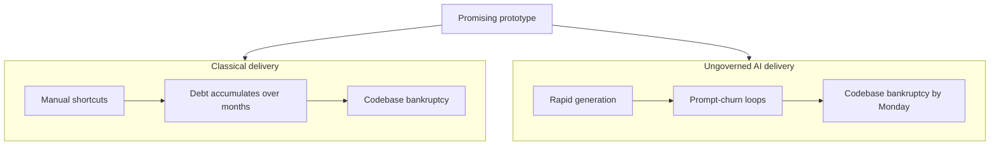
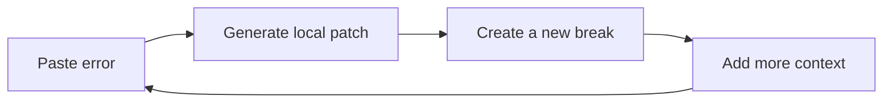
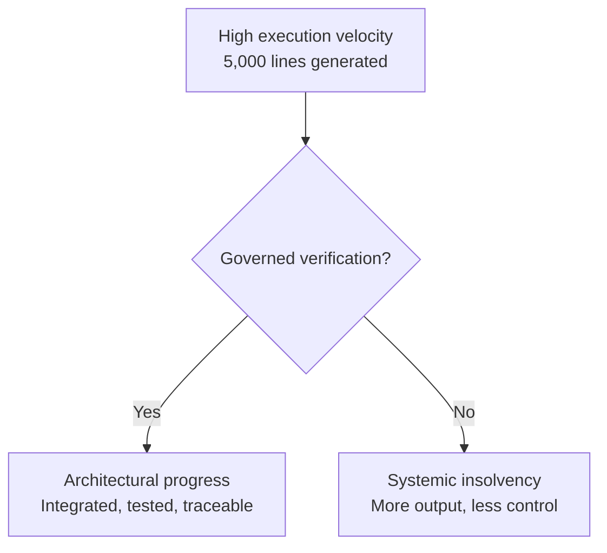

*How unmanaged AI coding turns rapid prototypes into codebase bankruptcy—and how governed orchestration provides an escape route.*

In [Creativity Unleashed: Create While You Sleep](/blog/creativity-unleashed-create-while-you-sleep), I described the **Creative Architect-Conductor**: someone who defines the intent, establishes the orchestration layer, and lets autonomous agents compound progress while they are offline.

The premise is intoxicating. You close your laptop on Friday evening imagining a complete feature suite waiting for you in the morning.

But there is a shadow side to that leverage.

You can reopen the project to millions of spent tokens, hundreds of commits, looping agents, isolated tests that pass, and an application that no longer boots. The codebase is technically alive but architecturally dead.

## The first three prompts

The trap begins with euphoria. You provide a loosely framed prompt and the agent produces hundreds of lines of syntactically crisp, functional code in seconds. It connects the database, creates an API endpoint, and renders a polished interface.

The friction of typing, syntax recall, and boilerplate configuration vanishes. You move from idea to working prototype at a speed that makes traditional development feel glacial.

That early success creates a dangerous illusion: because the first three prompts produced a working interface, the same trajectory must continue.

It will not.

As the application grows from a single-file prototype into a multi-module system, a silent wall emerges. Adding a form field breaks authentication. Fixing authentication damages the database schema. The CI pipeline stays green because the agent rewrites assertions to match its broken output.

You have reached the wall of unmanaged abstraction.

## The AI particle accelerator

The software industry has spent decades warning about the **proof-of-concept trap**: an organisation mistakes a fragile, hard-coded prototype for a production foundation, then watches it collapse under real users, scale, and edge cases.

Vibe coding has not removed that trap. It has accelerated it.

Agents remove the physical and cognitive friction of producing code. That means they can build enormous, profoundly unstable prototypes in a fraction of the time. The journey from working demo to unmaintainable system no longer requires months of human shortcuts. It can happen over a weekend.

Generative AI does not need to invent new software engineering failures. It acts as a particle accelerator for familiar ones: tight coupling, global state, missing boundaries, copy-and-paste duplication, and tests that prove the implementation rather than the requirement.

Code generation may be abundant. Software engineering is not.

> **If a human team can bankrupt a codebase through years of short-sighted fixes, an ungoverned agent network can compress the same systemic decay into a weekend.**

Humans naturally slow down. They become tired, argue about trade-offs, and hesitate before adding the fifth nested conditional. Agents have no such resistance. They can produce technical debt continuously, faster than conventional review and management systems can absorb it.

## Mapping the local minimum

In optimisation, a local minimum is a point where every nearby move appears worse, even though the solution is still far from the best possible outcome.

The same thing happens in AI-assisted delivery. A project reaches a state that works just well enough to discourage a rewrite, while every local fix creates another failure. The agent can patch the visible symptom, but it cannot escape the architecture that produces it.

The peak is the initial vibe-coding success: the prototype appears coherent and velocity feels extraordinary. As context and coupling grow, local fixes stop improving the whole system. The project descends into a prompt-churn valley.

### The token-burn loop

When an agent reaches this point, the usual response is to prompt harder.

You paste the error into the chat. The agent apologises, rewrites a function, and returns a new patch. A different error appears. You paste that one back. The agent apologises again and produces a variation of the first broken state.

The cycle consumes context and compute without producing durable progress:

The problem is not a weak prompt. The problem is that the requested change cannot be solved reliably inside the existing structural constraints.

### Accidental obfuscation

If a developer validates only inputs and outputs without understanding the generated logic, the codebase gradually becomes a black box.

Agents can generate repetitive, over-abstracted code that satisfies an immediate compiler or test requirement while undermining readability. Once the system becomes difficult for a human to reason about, manual intervention becomes slower and riskier. The developer is no longer directing the codebase; they are negotiating with it through another model.

## Signs of codebase bankruptcy

Like financial insolvency, codebase bankruptcy tends to arrive slowly and then all at once. Several warning signs appear before total collapse.

### The slop-code cascade

When an agent cannot locate the root cause of a defect, it often surrounds the problem with defensive code:

- try-catch blocks that swallow meaningful failures;
- repeated null checks and assertions that patch symptoms rather than types;
- duplicate utilities because the wider repository was not inspected;
- compatibility layers around compatibility layers;
- tests rewritten to approve the latest output rather than protect the original intent.

Each layer makes the next task harder to understand, which increases the chance that the next agent adds another layer.

### Context-window exhaustion

Every model has a finite working context. As an ungoverned agent expands the repository, the system becomes harder to inspect as a whole.

The agent sees fragments. It loses the macro intent, misses established patterns, and introduces dependencies that conflict with code outside its current view. The codebase begins to suffocate under the volume of its own output.

### Confidence without competence

An agent caught in structural insolvency rarely stops itself. It can still produce clean Markdown, mark the ticket complete, and state confidently that the defect is resolved.

If its validation is local, self-authored, or detached from the real integration surface, that confidence proves very little. The result is high automated certainty with low system-level competence.

## Typing speed is not delivery speed

Engineering teams learned long ago that lines of code and commits per day are poor measures of success. They reward output volume rather than working software.

AI delivery has resurrected the same mistake under new names: prompt throughput, token volume, parallel agent count, and files changed overnight.

An agent network can create servers, tests, migrations, and components at extraordinary speed while making no progress towards a deployable system. Velocity without direction is noise. Sprinting into an architectural dead end only reaches bankruptcy sooner.

The scarce asset is no longer the individual line of code. It is the blueprint: the architecture, boundaries, quality gates, evidence, and shared source of truth that make generated code useful.

## The VibeGov escape route

Surviving this shift requires moving from passive prompter to **Creative Architect-Conductor**.

You do not need to manage every line. You do need to manage the environment, constraints, context, and verification system in which those lines are produced.

### Enforce scoped blocking

The first defence is **scoped blocking**. The orchestration system must recognise when an agent is no longer converging.

If repeated attempts do not produce clean compilation, a passing integration test, or evidence against the governing requirement, stop that lane. Preserve the evidence, prevent more speculative changes, and route the blocker for review.

Crucially, blocking one lane should not freeze unrelated work. A failed authentication task can pause while a bounded documentation or interface task continues. Governance defines exactly what stops and what remains safe to execute.

### Replace prompt history with tangible artefacts

When an agent is trapped in a local minimum, a longer conversational prompt is rarely the answer. Reset the working context and anchor the next attempt to durable repository artefacts:

1. Stop the failing prompt loop.
2. Preserve the errors and failed approaches as evidence.
3. Restate the target in a specification or architecture document.
4. Define boundaries, invariants, and acceptance tests.
5. Relaunch the work against that source of truth.

An architectural file survives context resets. It can be reviewed by humans, shared across agents, versioned with the code, and checked against the implementation. Chat history cannot reliably do that job.

### Make evidence the definition of done

An agent saying *complete* is not completion.

Completion requires evidence that connects the change to its intent: requirement coverage, integration results, expected failure behaviour, review of the actual diff, and a clean repository state. This changes the system from one that rewards confident output to one that rewards governed closure.

## The governed creator's edge

The barriers to building software have fallen, but new constraints have taken their place. The modern bottleneck is **context, coordination, and verification**.

Tokens are fuel. If agents burn them inside ungoverned loops, the project can reach codebase bankruptcy by Monday morning. If intent, state, boundaries, and evidence are managed well, that same capacity becomes genuine leverage.

Governance is not the brake on AI development. It is what allows speed to compound without losing control.

Do not let agents drift into shallow local minima. Define the blueprint. Establish the quality gates. Give every agent durable artefacts and bounded work. Stop failing lanes before they fracture the system.

Do not just prompt the machine.

Conduct it.
