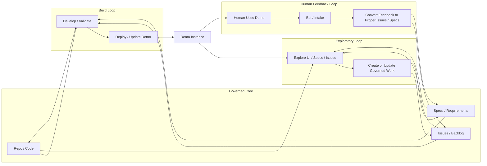
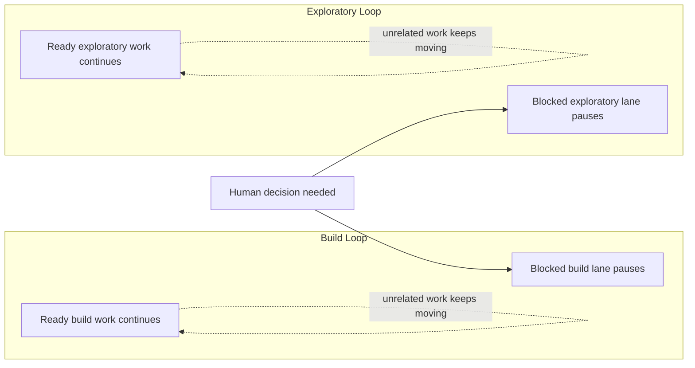

# Build Loop, Exploratory Loop, Human Feedback Loop, and Scoped Blocking

VibeGov works better when teams stop pretending there is only one loop.

A healthy agent-enabled system usually has at least three loops running in parallel:

- a **Build Loop**,
- an **Exploratory Loop**,
- and a **Human Feedback Loop**.

These loops should not be collapsed into one vague idea of "the agent is working."
They have different jobs, different sources, and different outputs.

## Loop model vs mode model

This page describes **loops**, not operating modes.
That distinction matters.

- a **loop** tells you where work sits in the wider system and how work enters or leaves it,
- a **mode** tells you what kind of work you are doing right now and what evidence closes it.

In practice:
- the **Build Loop** usually runs **Development** work,
- the **Exploratory Loop** usually runs **Exploration** work,
- the **Human Feedback Loop** often uses **Feedback Intake** to reshape either one,
- and the **Evaluation pattern** may appear inside either mode when bounded judgment is needed.

That is why loops and modes should support each other, not compete with each other.

## 1) Build Loop

The Build Loop is the delivery loop.

Its job is to consume already-scoped work and turn it into validated outputs.

### Source of truth

The Build Loop should take its input from:
- the repository,
- the issue backlog,
- the bound requirement/spec artifacts,
- and the active delivery state.

### Outputs

The Build Loop should write back:
- code changes,
- doc/spec changes,
- tests,
- validation evidence,
- issue or PR state updates,
- release-readiness or shipping evidence when relevant.

### Important boundary

The Build Loop should **not** recursively self-source its own next work from its own outputs.

That boundary matters.
If build starts inventing its own new backlog from its own emissions, it becomes unstable and harder to govern.

Build should be execution-stable:
- consume scoped work,
- produce clear outputs,
- close or advance the work item,
- continue to the next governed item.

## 2) Exploratory Loop

The Exploratory Loop is the non-delivery intelligence loop.

Its job is to inspect reality, judge coverage, discover drift, and feed governed work into delivery.

### What counts as exploratory work

Exploration is not only free-roaming inspection.
In VibeGov terms, it can include planner and evaluator behavior when the goal is non-delivery discovery.

Typical exploratory activity includes:
- UI exploration,
- workflow or route review,
- spec exploration,
- issue exploration,
- drift detection,
- gap analysis,
- backlog hydration,
- review/report generation,
- planner-style scoping of a review surface,
- evaluator-style judgment of exploratory artifacts or coverage.

So exploratory may involve:
- **planner roles** to choose or shape the review slice,
- **evaluator roles** to judge completeness, quality, or coverage,
- and sometimes **generator roles** to produce reports, inventories, or proposed follow-up artifacts.

What makes it exploratory is not the agent role name.
What makes it exploratory is that the work is **not directly delivering the product change**.

### Outputs

The Exploratory Loop should write back:
- findings,
- classifications,
- issue creation or linking,
- spec links or `SPEC_GAP` markers,
- coverage or confidence notes,
- scoped recommendations for delivery.

## 3) Human Feedback Loop

The Human Feedback Loop brings judgment, correction, taste, approval, and reprioritisation back into the system.

This loop exists so the human does not fall out of the operating model.

### Typical human-feedback inputs

- approval or rejection,
- correction of framing or scope,
- prioritisation changes,
- taste or quality direction,
- missing context,
- product judgment,
- strategic redirection,
- explicit blocking or go-ahead.

### Outputs

The Human Feedback Loop should feed back into the system by:
- changing backlog priority,
- narrowing or broadening scope,
- creating or reshaping governed work,
- changing acceptance criteria,
- or explicitly blocking/unblocking a specific path.

### Feedback Intake inside the Human Feedback Loop

The most common governed work shape inside this loop is **Feedback Intake**.

That means the agent should often:
- capture the feedback cleanly,
- check for existing related issues/specs,
- split broad feedback into the right work units,
- bind or create the right issue/spec artifacts,
- classify readiness/dependencies,
- and stop before implementation unless the human explicitly switches modes.

This is how human feedback becomes governed backlog/spec state instead of evaporating into chat or immediately collapsing into ad hoc implementation.

## 4) Scoped Blocking

Human feedback should not become a global stop-the-world gate by default.

That is where **scoped blocking** matters.

### Scoped blocking means

- only the work that truly requires human input should pause,
- unrelated build work can continue,
- unrelated exploratory work can continue,
- and the system should make the blocked boundary explicit.

### Examples

#### Good scoped blocking
- "Do not ship this PR until human approval is given."
- "Pause this design direction until the user chooses option A or B."
- "Do not merge the release candidate until the blocker issue is resolved."

#### Bad global blocking
- "A question was asked somewhere, so all progress stops."
- "The human has not replied yet, so no loop may continue."
- "One route is blocked, therefore the full exploratory pass stops."

## How the loops relate

### Build Loop
- consumes governed scoped work
- changes reality
- produces delivery artifacts

### Exploratory Loop
- inspects reality
- finds gaps and uncovered work
- feeds governed work into backlog/specs

### Human Feedback Loop
- reshapes intent, priority, judgment, and approval state
- feeds corrections and decisions into build and exploration

## A practical model

A healthy project can look like this:

- **Build Loop** continues on ready issue-bound work from the repo/backlog.
- **Exploratory Loop** reviews UI, specs, and issues, and keeps adding focused follow-up work.
- **Human Feedback Loop** injects approval, correction, redirection, and new scope where needed.
- **Scoped blocking** pauses only the exact lane that truly needs a human decision.

That gives you:
- delivery momentum,
- continuous backlog hydration,
- and real human-in-the-loop governance without freezing everything.

## Diagram

### Loop system view

Key rule: the Build Loop consumes governed work from the repo, specs, and issues, but new work should usually be fed into that source side by Exploration and Human Feedback rather than by build recursively inventing its own backlog.

### Scoped blocking view

This is the important blocker rule: pause only the lane that truly needs the missing answer. Do not let one unresolved human input freeze every build and exploratory path by default.

## Fast rule

Ask four questions:

1. Am I consuming governed work and changing reality? → **Build Loop**
2. Am I reviewing reality and feeding new governed work? → **Exploratory Loop**
3. Am I injecting human judgment, approval, or reprioritisation? → **Human Feedback Loop**
4. Am I capturing that input into governed ready work without implementing yet? → **Feedback Intake**
5. Does this input block everything, or only one specific lane? → apply **Scoped Blocking**

## Related docs

- [Execution Modes](/docs/execution-modes)
- [Feedback Intake](/docs/feedback-intake)
- [Mode Selection and Evidence Closing](/docs/mode-selection-and-evidence-closing)
- [Exploratory Review Mode](/docs/exploratory-review-mode)
- [Evaluation Pattern](/docs/evaluation-pattern)
- [Feedback Assimilation Pattern](/docs/feedback-assimilation-pattern)
- [Reference Reading](/docs/reference-reading)
- [Checkpoint Reporting](/docs/checkpoint-reporting)
